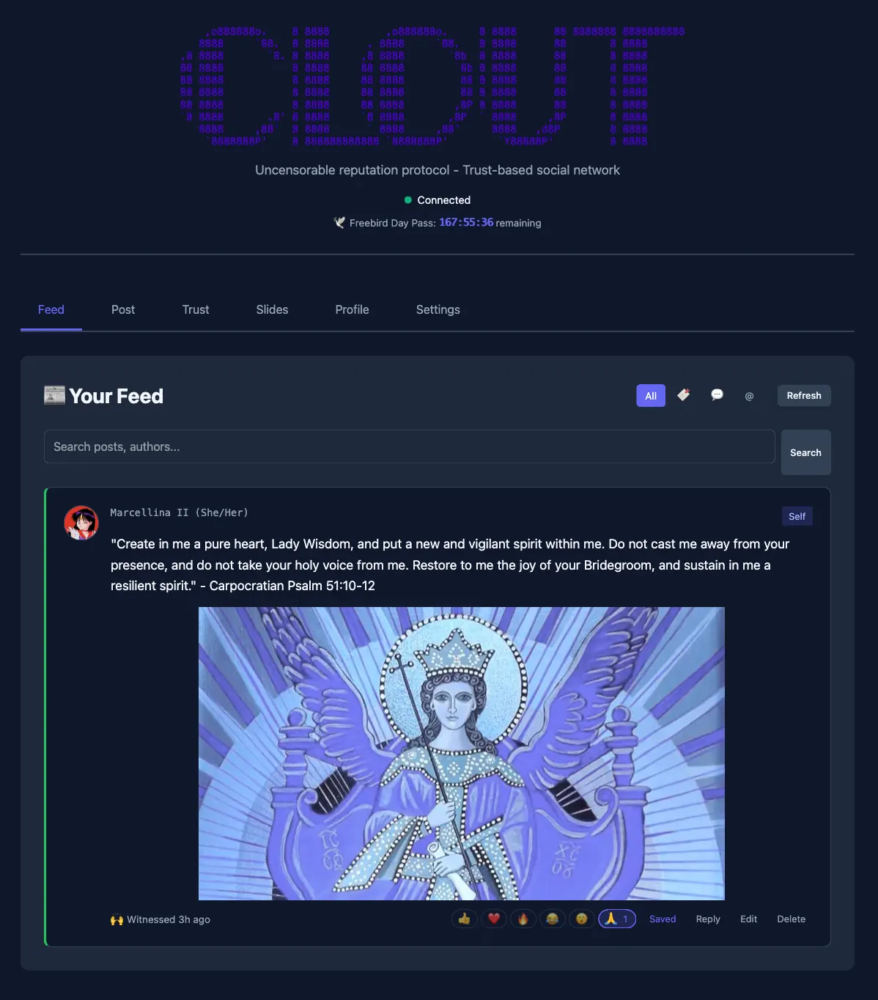
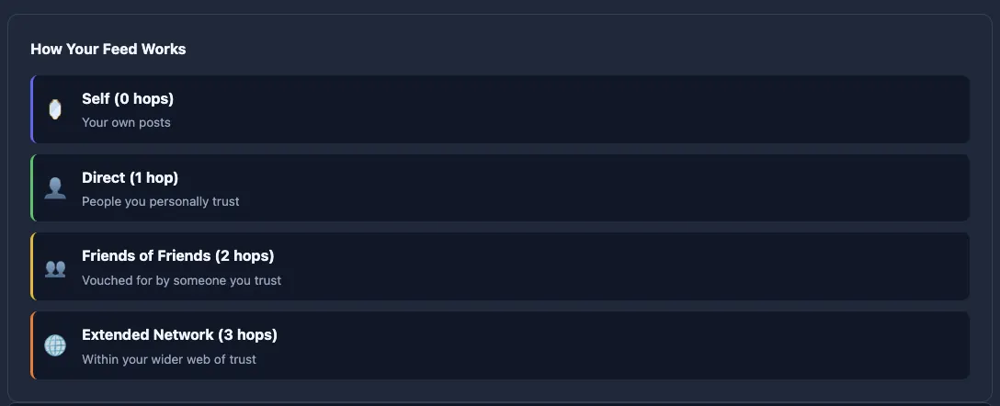

# 🌑 Clout

**Clout** is a decentralized social protocol that gives you complete control over your feed through transparent, user-controlled content filtering—not hidden algorithms.

<div align=center><br></div>

## The Problem with Social Media Today

Modern social platforms share the same fundamental flaws:

| Problem | How Platforms Fail You |
|---------|----------------------|
| **Invisible Censorship** | Algorithms shadowban content with no transparency or appeal |
| **Algorithmic Radicalization** | Engagement-driven feeds amplify extreme content for clicks |
| **Privacy Exploitation** | Your social graph is mapped, sold, and weaponized against you |
| **Spam & Bot Armies** | Creating fake accounts is free and instant |
| **Cognitive Overload** | Feeds exceed human processing limits, requiring algorithmic curation |
| **Data Hostage** | Your content and connections are locked in corporate silos |

**Clout solves all of these.**

---

## BE A PART OF IT - Quick Start

Get running in one command:

```bash
git clone https://git.carpocratian.org/sibyl/clout && cd clout
docker compose up --build
```

Open **http://localhost:3000** — you're now running your own Clout node.

### CLI Commands

```bash
# Create your identity
docker compose run --rm cli identity create

# Post to the network
docker compose run --rm cli post "Hello, decentralized world!"

# View your feed
docker compose run --rm cli feed

# Trust someone
docker compose run --rm cli follow <publicKey>

# Send encrypted DM
docker compose run --rm cli slide <publicKey> "Private message"
```

### What Gets Deployed

| Service | Port | Purpose |
|---------|------|---------|
| **Clout** | 3000 | Web UI + API server |
| **Witness Cluster** | 8080 | Distributed timestamping (3 nodes + gateway) |
| **Freebird Issuer** | 8081 | Anti-spam token generation |
| **Freebird Verifier** | 8082 | Token validation + Redis cache |
| **HyperToken Relay** | 3001 | P2P WebRTC signaling |

All services run locally—no external dependencies, no data leaves your machine.

---

## Install Anywhere: Progressive Web App

Clout is a **Progressive Web App**—install it on any device without app stores:

| Platform | How to Install |
|----------|---------------|
| **Android** | Chrome menu → "Add to Home Screen" |
| **iOS/Safari** | Share button → "Add to Home Screen" |
| **Desktop** | Click install icon in address bar |

### What You Get

- **Native app experience**: Standalone window, no browser chrome
- **Offline shell**: App loads instantly from cache
- **Background updates**: New versions install automatically
- **Shortcuts**: Jump directly to New Post or Messages

No app store approval. No middleman. No tracking.

---

## The Dark Social Graph

Your social relationships are **yours**—stored in your browser, invisible to servers.

| Data | Where It Lives | Who Can See It |
|------|----------------|----------------|
| Trust connections | Your browser (IndexedDB) | Only you |
| Nicknames | Your browser | Only you |
| Mutes | Your browser | Only you |
| Bookmarks | Your browser | Only you |
| Tags | Your browser | Only you |

**Why "Dark"?** Because your social graph is cryptographically hidden. When you trust someone, only they know. Third parties—including the server you connect through—cannot map your relationships.

### Export Everything

Your Dark Social Graph travels with you:

```bash
# Download complete encrypted backup (JSON)
Settings → Data Management → Download Backup

# Import on any device
Settings → Data Management → Select Backup File
```

Backup includes: identity keys, profile data, trust signals, nicknames, tags, mutes, bookmarks, and settings—all in a single encrypted file.

---

## The Auto-Shadowban: Transparent Content Filtering

Clout's core innovation is the **auto-shadowban**—content filtering that's transparent, user-controlled, and impossible to weaponize against you.

### How It Works

When your node receives content from the network:

```
1. TRUST CHECK: Is the author within your trust graph?
   ├─ YES → Accept post, add to feed, propagate to peers
   └─ NO  → Silently drop (auto-shadowban)

2. REPUTATION CHECK: Does author meet your minimum trust score?
   ├─ YES → Continue processing
   └─ NO  → Auto-shadowban

3. VERIFICATION: Valid timestamp? Content hash matches? Signature valid?
   ├─ YES → Display in feed
   └─ NO  → Reject as invalid
```

### Why This Changes Everything

| Traditional Shadowban | Clout Auto-Shadowban |
|----------------------|---------------------|
| Hidden, arbitrary, centralized | Transparent, rule-based, personal |
| Platform decides who you see | **You** decide who you see |
| No appeal, no explanation | Rules are visible and configurable |
| Weaponized for censorship | Impossible to censor—only you control your graph |

**The key insight**: On Clout, "shadowbanning" isn't censorship—it's your personal spam filter. You define the rules. No central authority can silence anyone; they can only choose not to listen.

---

## Trust Graph: Your Personal Algorithm

Instead of a black-box algorithm, your feed is determined by your **trust graph**—people you trust, and people they trust.

<div align=center><br></div>

```
Distance 0: You (trust score: 1.0)
    │
Distance 1: People you directly trust (score: 0.9)
    │
Distance 2: Friends of friends (score: 0.6)
    │
Distance 3: Extended network (score: 0.3)
    │
Distance 4+: Auto-shadowbanned (not in your reality)
```

### Consent-Based Trust Requests

Trust is mutual. When you want to follow someone, you send a **trust request**—an encrypted message only they can read:

```
1. You → Send trust request (encrypted via slide)
   ├─ Includes: your profile, desired weight, optional message
   └─ Only recipient can decrypt and see the request

2. Recipient → Decides to accept or ignore
   ├─ ACCEPT → Mutual trust established, you enter each other's feeds
   └─ IGNORE → Request stays pending (no notification to sender)

3. Both parties can withdraw/revoke at any time
```

Trust requests prevent spam follows and ensure relationships are consensual. The sender never knows if they were rejected—they only see "pending" or "accepted."

### Weighted Trust

Not all relationships are equal. Assign trust weights from 0.1 to 1.0:

```typescript
await clout.trust(aliceKey, 1.0);   // Close friend: full trust
await clout.trust(bobKey, 0.5);     // Acquaintance: half trust
await clout.trust(carolKey, 0.1);   // Ugh, fucking Carol? minimal trust
```

Trust multiplies through paths: if you trust Alice (0.8) and Alice trusts Bob (0.7), your effective trust in Bob is 0.56.

### Temporal Decay

Trust naturally fades over time, reflecting real relationships:

- Fresh trust: 1.0× multiplier
- 1 year old: 0.5× multiplier
- 2 years old: 0.25× multiplier

Inactive connections gradually drop out of your feed. Active relationships stay strong.

---

## Village-Scale Networking

Clout respects **Dunbar's number** (~150)—the cognitive limit for stable social relationships.

### The Math

With `maxHops: 3` (default):

| Distance | Reach | Trust Score |
|----------|-------|-------------|
| 1 hop | ~50-150 people | 0.9 |
| 2 hops | ~2,500-22,500 people | 0.6 |
| 3 hops | ~125k-3.3M people | 0.3 |

Your feed stays cognitively manageable while your network provides content diversity.

### Contrast with Legacy Platforms

| Platform | Approach | Result |
|----------|----------|--------|
| Facebook | 338 average "friends" (2× Dunbar) | Algorithmic curation required |
| Twitter/X | Unlimited follows | Information firehose, algorithmic sorting |
| **Clout** | Trust graph with natural limits | No algorithm needed—trust itself is the filter |

---

## Browser-Native Identity

Your identity is a **cryptographic keypair generated in your browser**. No server ever sees your private key.

| Component | Where It Lives |
|-----------|---------------|
| Private key | Your browser (IndexedDB) |
| Public key | Shared with network (your address) |
| Signatures | Generated client-side |

### Identity Operations

```bash
# View your public key (shareable)
Profile → Your Public Key → Copy

# Generate QR code for easy sharing
Profile → QR Code

# Backup identity (encrypted)
Profile → Export Identity → Enter Password

# Restore on new device
Profile → Import Identity → Select File
```

**Key insight**: Because your private key never leaves your browser, no server—not even the one you're connected to—can impersonate you or read your encrypted messages.

---

## Privacy by Default

### Encrypted Trust Signals

When you trust someone, only they know. Third parties cannot map your social graph.

### Tor Integration

Full anonymity with circuit isolation per destination:

```typescript
const torProxy = new TorProxy({
  proxyHost: 'localhost',
  proxyPort: 9050,
  circuitIsolation: true  // Prevents correlation attacks
});
```

### Ephemeral Keys

Posts use rotating keys (24-hour rotation) for forward secrecy. Even if a key is compromised, historical posts remain protected.

---

## Spam Resistance: Economic Friction for Bad Actors

### Day Pass System

Posting requires a **Day Pass**, obtained through Freebird tokens (proof-of-work or invitation):

| Reputation | Pass Duration | Rationale |
|------------|---------------|-----------|
| ≥0.9 | 7 days | Highly trusted: minimal friction |
| ≥0.7 | 3 days | Established: light friction |
| ≥0.5 | 2 days | Building trust: moderate friction |
| <0.5 | 1 day | New/unvetted: high friction |

### Invitation System

New users join through **invitation codes** from existing members:

1. Existing member generates invitation code
2. New user redeems code → creates browser identity
3. Mutual trust established automatically (inviter ↔ invitee)
4. New user receives Day Pass to start posting

**Web of trust, not corporate gatekeeping**: You vouch for people you know. Bad actors must infiltrate real social networks—expensive at scale.

### Delegated Passes

High-reputation users can vouch for newcomers:

```typescript
// Sponsor a new user (requires reputation ≥0.7)
await clout.delegatePass(newUserKey, 24);  // 24-hour pass
```

Delegation limits prevent abuse:
- Reputation ≥0.9: 10 passes/week
- Reputation ≥0.7: 5 passes/week

---

## Rich Media: Share More Than Text

Clout supports content-addressed media storage—your files live on the distributed network, not corporate servers:

| Media Type | Supported Formats |
|------------|-------------------|
| **Images** | PNG, JPEG, GIF, WebP, SVG |
| **Video** | MP4, WebM, OGG |
| **Audio** | MP3, WAV, OGG |
| **Documents** | PDF |

```bash
clout post "Check this out!" --media ./photo.jpg
clout post "New track" --media ./song.mp3
```

### P2P Media Fetching

Media is fetched directly from authors' nodes:

| Trust Distance | Media Access |
|---------------|--------------|
| 1 hop (direct) | Always available |
| 2 hops | Configurable per media type |
| 3+ hops | Requires explicit trust settings |

Configure per content type:
```
Settings → Media Trust Settings → Images/Videos/Audio → Max Distance
```

---

## Real-Time Updates

Stay connected with live updates through Server-Sent Events (SSE):

- New posts from your trust graph appear instantly
- Replies and reactions notify you immediately
- Direct messages arrive in real-time
- Offline indicator shows connection status
- No polling required—efficient push-based architecture

---

## Feed Sorting & Discovery

Control how content appears in your feed:

| Sort Option | Algorithm |
|-------------|-----------|
| **Newest** | Chronological, most recent first |
| **Reactions** | Posts with most reactions (👍❤️🔥) |
| **Replies** | Posts generating most discussion |
| **Hot** | Engagement weighted by recency: `(reactions + replies×2) / (age+2)^1.5` |

```bash
# API examples
curl /api/feed?sort=hot
curl /api/feed?sort=reactions&limit=20&offset=40
```

---

## Link Previews

Posts containing URLs automatically display OpenGraph metadata:

- **Title** and **description** from the linked page
- **Site name** for context
- Privacy-focused: no images fetched to prevent tracking
- Server-side proxy prevents CORS issues

When you post a link, the preview data is stored with the post and displayed inline—giving your network context without requiring them to click.

---

## Encrypted Direct Messages (Slides)

End-to-end encrypted DMs that propagate through the gossip network:

- **X25519 key exchange** + **XChaCha20-Poly1305 AEAD**
- Ephemeral keypairs for forward secrecy
- No day pass required
- Only sender and recipient can read content

```bash
clout slide <recipientKey> "Your private message"
clout slides  # View inbox
```

---

## Author Control: Edit & Retract

Unlike centralized platforms where your content lives forever at their mercy, Clout gives you complete control:

### Edit Posts
Update your posts while preserving thread integrity:
```bash
clout edit <postId> "Updated content"
```

Edits create a transparent version chain—viewers see the current version with full history available. **Edit chain resolution** ensures replies always link to the latest version of the post, not orphaned old versions.

### Retract Posts
Remove your content from circulation:
```bash
clout retract <postId>
```
Retracted posts are marked as withdrawn. Nodes respect author intent and filter them from feeds.

### Mute Users
Hide content without affecting trust relationships:
```bash
clout mute <publicKey>    # Silence without unfollowing
clout unmute <publicKey>
```

Mutes are stored locally in your Dark Social Graph—the muted person never knows.

---

## Content Warnings & NSFW Controls

Mark sensitive content and let viewers decide what they see:

```bash
clout post --nsfw "Adult content here"
clout post --cw "Spoilers for latest episode" "The ending was..."
```

Configure your feed preferences:
```
Settings → Content Filtering → Show NSFW content
```

**User control, not platform censorship**: Content isn't removed—you choose whether to see it.

---

## Content-Type Filtering

Set different trust thresholds per content type:

```typescript
const clout = new Clout({
  // ...
  contentTypeFilters: {
    'slide': { maxHops: 5, minReputation: 0.2 },      // DMs: permissive
    'image/png': { maxHops: 2, minReputation: 0.7 },  // Images: strict
    'text/plain': { maxHops: 3, minReputation: 0.4 }  // Text: moderate
  }
});
```

---

## Web Interface Features

**Full-featured social experience:**

| Feature | Description |
|---------|-------------|
| **Feed** | Personalized content from your trust graph with real-time updates |
| **Feed Sorting** | Newest, most reactions, most replies, or "hot" algorithm |
| **Posts** | Rich content with images, video, audio, and PDFs |
| **Link Previews** | OpenGraph metadata for shared URLs |
| **Threads** | Full conversation views with nested replies and edit chain resolution |
| **Reactions** | Express yourself (👍 ❤️ 🔥 😂 😮 🙏) |
| **Trust Requests** | Consent-based following with encrypted requests |
| **Bookmarks** | Save posts locally (never leaves your browser) |
| **Search** | Find posts and users across your network |
| **Tags** | Organize trusted users into groups, filter feed by tag |
| **Nicknames** | Set private names for users (only you see them) |
| **Slides (DMs)** | End-to-end encrypted direct messages |
| **Profiles** | Display name, bio, and avatar (embedded in posts) |
| **QR Codes** | Share your public key easily |
| **Notifications** | Badge counts for replies, mentions, and DMs |
| **Offline Mode** | View cached content when disconnected |
| **Owner Dashboard** | Invitation management and member moderation |

---

## API Reference

Full REST API for programmatic access:

### Feed & Posts
| Endpoint | Method | Description |
|----------|--------|-------------|
| `/api/feed` | GET | Get personalized feed (supports `?sort=newest\|reactions\|replies\|hot`) |
| `/api/feed/tag/:tag` | GET | Get posts from tagged users |
| `/api/post` | POST | Create new post |
| `/api/post/:id` | PUT | Edit post |
| `/api/post/:id/retract` | POST | Retract post |
| `/api/thread/:id` | GET | Get thread with replies (resolves edit chains) |
| `/api/search` | GET | Search posts |

### Reactions & Bookmarks
| Endpoint | Method | Description |
|----------|--------|-------------|
| `/api/react` | POST | Add reaction |
| `/api/unreact` | POST | Remove reaction |
| `/api/bookmark` | POST | Save post |
| `/api/unbookmark` | POST | Remove bookmark |
| `/api/bookmarks` | GET | Get bookmarked posts |
| `/api/mentions` | GET | Get posts mentioning you |

### Trust & Social Graph
| Endpoint | Method | Description |
|----------|--------|-------------|
| `/api/trust` | POST | Trust a user (direct trust) |
| `/api/trust/:publicKey` | DELETE | Revoke trust |
| `/api/trusted` | GET | List trusted users |
| `/api/reputation/:publicKey` | GET | Get reputation score |
| `/api/mute` | POST | Mute user |
| `/api/unmute` | POST | Unmute user |
| `/api/muted` | GET | List muted users |
| `/api/tags` | GET/POST/DELETE | Manage user tags |
| `/api/nickname` | POST | Set nickname |
| `/api/nicknames` | GET | List all nicknames |

### Trust Requests (Consent-Based)
| Endpoint | Method | Description |
|----------|--------|-------------|
| `/api/trust-request` | POST | Send trust request |
| `/api/trust-requests/incoming` | GET | Get pending requests |
| `/api/trust-requests/outgoing` | GET | Get sent requests |
| `/api/trust-request/:id/accept` | POST | Accept request |
| `/api/trust-request/:id/reject` | POST | Reject request (silent) |
| `/api/trust-request/:id` | DELETE | Withdraw request |
| `/api/trust-request/:id/retry` | POST | Retry ghosted request |

### Slides (DMs)
| Endpoint | Method | Description |
|----------|--------|-------------|
| `/api/slides` | POST | Send encrypted message |
| `/api/slides` | GET | Get inbox |

### Media
| Endpoint | Method | Description |
|----------|--------|-------------|
| `/api/media/upload` | POST | Upload media file |
| `/api/media/:cid` | GET | Fetch media by CID |
| `/api/media/post/:postId` | GET | Fetch media for post |

### Link Previews
| Endpoint | Method | Description |
|----------|--------|-------------|
| `/api/opengraph/fetch` | GET | Fetch OpenGraph metadata for URL |

### Identity & Settings
| Endpoint | Method | Description |
|----------|--------|-------------|
| `/api/identity` | GET | Get current identity |
| `/api/identity/current` | GET | Get current identity details |
| `/api/identities` | GET | List all identities |
| `/api/identities` | POST | Create new identity |
| `/api/identities/switch` | POST | Switch default identity |
| `/api/identities/:name/export` | GET | Export identity secret key |
| `/api/identities/import` | POST | Import identity from secret key |
| `/api/profile` | POST | Update profile |
| `/api/settings` | GET/POST | Manage settings |
| `/api/data/export` | GET | Export encrypted backup |
| `/api/data/import` | POST | Import backup |

### Real-Time
| Endpoint | Method | Description |
|----------|--------|-------------|
| `/api/live` | GET (SSE) | Real-time event stream |
| `/api/live/status` | GET | Connected client count |
| `/api/notifications/counts` | GET | Notification badges |
| `/api/notifications/replies` | GET | Get replies to my posts |
| `/api/notifications/mark-seen` | POST | Mark notifications as seen |

### Admin (Instance Owner)
| Endpoint | Method | Description |
|----------|--------|-------------|
| `/api/admin/members` | GET | List members with quota |
| `/api/admin/quota/grant` | POST | Grant invitation quota |
| `/api/admin/invitations` | GET | List all invitations |
| `/api/admin/invitations` | POST | Create invitations (bypass quota) |
| `/api/admin/stats` | GET | Freebird statistics |
| `/api/admin/users` | GET | List all Freebird users |
| `/api/admin/users/ban` | POST | Ban a user |
| `/api/admin/user-lookup` | GET | Lookup user by public key |
| `/api/invitations/quota` | GET | Get my quota status |
| `/api/invitations/mine` | GET | List my created invitations |
| `/api/invitations/create` | POST | Create invitation (uses quota) |

---

## Instance Administration

When you deploy a Clout instance, you become the **instance owner**—responsible for onboarding members and maintaining community health.

### Owner Capabilities

| Feature | Description |
|---------|-------------|
| **Create Invitations** | Generate invitation codes without quota limits |
| **Grant Quota** | Allow trusted members to invite others |
| **User Lookup** | Find which invitation code a user redeemed |
| **Ban Users** | Remove bad actors (optionally including their invite tree) |
| **View Statistics** | Monitor Freebird token usage and member counts |

### Invitation Quota System

Members can invite others—but only if the owner grants them quota:

```
1. Owner grants quota to Alice (5 invitations)
2. Alice creates invitation code
3. Bob redeems code → joins network
4. Alice's quota decreases (4 remaining)
5. Owner can trace: Bob → Alice → Owner
```

This creates an **accountability chain**: every member can be traced back through their invitation path. Bad actors can be banned along with everyone they invited.

### Environment Variables

| Variable | Description | Default |
|----------|-------------|---------|
| `CLOUT_AUTH` | Require authentication | `false` |
| `FREEBIRD_ADMIN_KEY` | Admin API key for Freebird | (required for admin) |
| `FREEBIRD_SYBIL_MODE` | `invitation` or `pow` | `invitation` |
| `WITNESS_NETWORK_ID` | Witness cluster ID | `clout-testnet` |

---

## Programmatic Usage

```typescript
import { Clout, Crypto, FreebirdAdapter, WitnessAdapter } from 'clout';

const keypair = Crypto.generateKeyPair();
const clout = new Clout({
  publicKey: keypair.publicKey,
  privateKey: keypair.privateKey.bytes,
  freebird: new FreebirdAdapter({ /* config */ }),
  witness: new WitnessAdapter({ /* config */ }),
  maxHops: 3,
  minReputation: 0.3
});

// Build your trust network
await clout.trust(aliceKey, 1.0);
clout.addTrustTag(aliceKey, 'friends');

// Post content
const post = await clout.post('Hello world!');

// Get your personalized feed
const feed = await clout.getFeed();
const friendsPosts = await clout.getFeed({ tag: 'friends' });

// Edit a post (creates version chain, preserves replies)
await clout.editPost(post.id, 'Updated hello world!');

// Send encrypted DM
await clout.sendSlide(aliceKey, 'Private message');
```

---

## Architecture

Clout inverts [Scarcity](https://git.carpocratian.org/sibyl/Scarcity)'s money protocol into a reputation protocol:

| Component | Scarcity (Money) | Clout (Reputation) |
|-----------|------------------|-------------------|
| Primitive | Token (value) | Post (content) |
| Operation | transfer() | post() |
| Gossip Logic | "Seen this? REJECT" | "Trust author? ACCEPT" |
| Validation | Prevent double-spend | Check trust distance |

### Core Modules

The codebase is organized into focused modules:

**Backend (`src/clout/`)**
| Module | Responsibility |
|--------|----------------|
| `economics.ts` | Day passes, tickets, delegation |
| `content.ts` | Post creation, editing, retraction |
| `media.ts` | WNFS storage, P2P media fetch |
| `trust.ts` | Social graph, encrypted signals |
| `reactions.ts` | Trust-weighted reactions |
| `feed.ts` | Feed filtering, caching, edit chain resolution |
| `backup.ts` | Export/import |
| `relay.ts` | Browser identity relay |

**Frontend (`src/web/public/js/`)**
| Module | Responsibility |
|--------|----------------|
| `state.js` | Shared application state |
| `api.js` | HTTP communication layer |
| `feed.js` | Feed rendering and filtering |
| `posts.js` | Post creation and editing |
| `trust.js` | Trust list management |
| `thread.js` | Thread view |
| `slides.js` | Encrypted DMs |
| `profile.js` | Identity and settings |
| `notifications.js` | SSE and badges |

---

## Dependencies

Built on Scarcity's infrastructure:

- **Freebird**: Anonymous authorization (P-256 VOPRF)
- **Witness**: Threshold timestamping
- **HyperToken**: P2P networking and CRDT sync
- **@noble/curves** & **@noble/hashes**: Cryptographic primitives

---

## License

Apache-2.0

## Credits

Built by refactoring [Scarcity](https://git.carpocratian.org/sibyl/Scarcity), with:
- [Freebird](https://git.carpocratian.org/sibyl/Freebird) | [Witness](https://git.carpocratian.org/sibyl/Witness) | [HyperToken](https://git.carpocratian.org/sibyl/Hypertoken)

*The architecture inverts Scarcity's "Conservation of Value" into Clout's "Propagation of Signal."*
