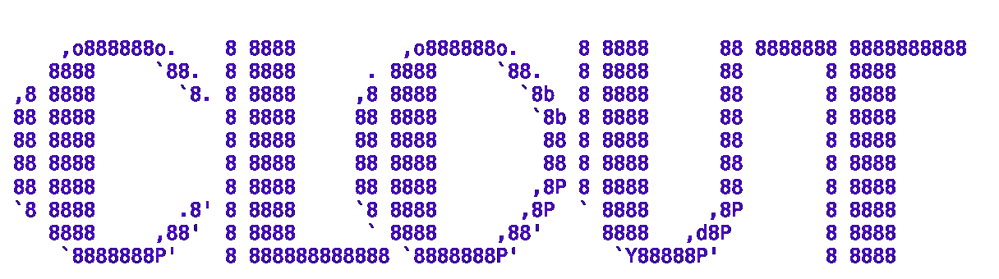

[<div align=center>](https://carpocratian.org/en/church/)
[<div align=center><br>](https://carpocratian.org/en/church/)

_A mission of [The Carpocratian Church of Commonality and Equality](https://carpocratian.org/en/church/)_.</div>
<div align=center></div></div>

# Clout: Uncensorable Social Networking

**Clout** is a decentralized social protocol that gives you complete control over your feed through transparent, user-controlled content filtering—not hidden algorithms.

## The Problem with Social Media Today

Modern social platforms share the same fundamental flaws:

| Problem | How Platforms Fail You |
|---------|----------------------|
| **Invisible Censorship** | Algorithms shadowban content with no transparency or appeal |
| **Algorithmic Radicalization** | Engagement-driven feeds amplify extreme content for clicks |
| **Privacy Exploitation** | Your social graph is mapped, sold, and weaponized against you |
| **Spam & Bot Armies** | Creating fake accounts is free and instant |
| **Cognitive Overload** | Feeds exceed human processing limits, requiring algorithmic curation |
| **Data Hostage** | Your content and connections are locked in corporate silos |

**Clout solves all of these.**

---

## The Auto-Shadowban: Transparent Content Filtering

Clout's core innovation is the **auto-shadowban**—content filtering that's transparent, user-controlled, and impossible to weaponize against you.

### How It Works

When your node receives content from the network:

```
1. TRUST CHECK: Is the author within your trust graph?
   ├─ YES → Accept post, add to feed, propagate to peers
   └─ NO  → Silently drop (auto-shadowban)

2. REPUTATION CHECK: Does author meet your minimum trust score?
   ├─ YES → Continue processing
   └─ NO  → Auto-shadowban

3. VERIFICATION: Valid timestamp? Content hash matches? Signature valid?
   ├─ YES → Display in feed
   └─ NO  → Reject as invalid
```

### Why This Changes Everything

| Traditional Shadowban | Clout Auto-Shadowban |
|----------------------|---------------------|
| Hidden, arbitrary, centralized | Transparent, rule-based, personal |
| Platform decides who you see | **You** decide who you see |
| No appeal, no explanation | Rules are visible and configurable |
| Weaponized for censorship | Impossible to censor—only you control your graph |

**The key insight**: On Clout, "shadowbanning" isn't censorship—it's your personal spam filter. You define the rules. No central authority can silence anyone; they can only choose not to listen.

---

## Trust Graph: Your Personal Algorithm

Instead of a black-box algorithm, your feed is determined by your **trust graph**—people you trust, and people they trust.

```
Distance 0: You (trust score: 1.0)
    │
Distance 1: People you directly trust (score: 0.9)
    │
Distance 2: Friends of friends (score: 0.6)
    │
Distance 3: Extended network (score: 0.3)
    │
Distance 4+: Auto-shadowbanned (not in your reality)
```

### Weighted Trust

Not all relationships are equal. Assign trust weights from 0.1 to 1.0:

```typescript
await clout.trust(aliceKey, 1.0);   // Close friend: full trust
await clout.trust(bobKey, 0.5);     // Acquaintance: half trust
await clout.trust(carolKey, 0.1);   // New contact: minimal trust
```

Trust multiplies through paths: if you trust Alice (0.8) and Alice trusts Bob (0.7), your effective trust in Bob is 0.56.

### Temporal Decay

Trust naturally fades over time, reflecting real relationships:

- Fresh trust: 1.0× multiplier
- 1 year old: 0.5× multiplier
- 2 years old: 0.25× multiplier

Inactive connections gradually drop out of your feed. Active relationships stay strong.

---

## Village-Scale Networking

Clout respects **Dunbar's number** (~150)—the cognitive limit for stable social relationships.

### The Math

With `maxHops: 3` (default):

| Distance | Reach | Trust Score |
|----------|-------|-------------|
| 1 hop | ~50-150 people | 0.9 |
| 2 hops | ~2,500-22,500 people | 0.6 |
| 3 hops | ~125k-3.3M people | 0.3 |

Your feed stays cognitively manageable while your network provides content diversity.

### Contrast with Legacy Platforms

| Platform | Approach | Result |
|----------|----------|--------|
| Facebook | 338 average "friends" (2× Dunbar) | Algorithmic curation required |
| Twitter/X | Unlimited follows | Information firehose, algorithmic sorting |
| **Clout** | Trust graph with natural limits | No algorithm needed—trust itself is the filter |

---

## Privacy by Default

### Encrypted Trust Signals

When you trust someone, only they know. Third parties cannot map your social graph.

### Tor Integration

Full anonymity with circuit isolation per destination:

```typescript
const torProxy = new TorProxy({
  proxyHost: 'localhost',
  proxyPort: 9050,
  circuitIsolation: true  // Prevents correlation attacks
});
```

### Ephemeral Keys

Posts use rotating keys (24-hour rotation) for forward secrecy. Even if a key is compromised, historical posts remain protected.

---

## Spam Resistance: Economic Friction for Bad Actors

### Day Pass System

Posting requires a **Day Pass**, obtained through Freebird tokens (proof-of-work or invitation):

| Reputation | Pass Duration | Rationale |
|------------|---------------|-----------|
| ≥0.9 | 7 days | Highly trusted: minimal friction |
| ≥0.7 | 3 days | Established: light friction |
| ≥0.5 | 2 days | Building trust: moderate friction |
| <0.5 | 1 day | New/unvetted: high friction |

### Delegated Passes

High-reputation users can vouch for newcomers:

```typescript
// Sponsor a new user (requires reputation ≥0.7)
await clout.delegatePass(newUserKey, 24);  // 24-hour pass
```

Delegation limits prevent abuse:
- Reputation ≥0.9: 10 passes/week
- Reputation ≥0.7: 5 passes/week

Spammers must continuously solve proof-of-work or infiltrate trust networks—both expensive at scale.

---

## Encrypted Direct Messages (Slides)

End-to-end encrypted DMs that propagate through the gossip network:

- **X25519 key exchange** + **XChaCha20-Poly1305 AEAD**
- Ephemeral keypairs for forward secrecy
- No day pass required
- Only sender and recipient can read content

```bash
clout slide <recipientKey> "Your private message"
clout slides  # View inbox
```

---

## Your Data, Your Control

### P2P State Sync

Profiles sync via CRDT (Conflict-free Replicated Data Types). No central database. You own your data.

### Portable Identity

Your identity is a cryptographic keypair stored locally:

```bash
clout identity create    # Generate new identity
clout identity list      # View all identities
clout id                 # Show current identity
```

Export and import your complete state:

```typescript
const backup = clout.exportState();
// ... later ...
clout.importState(backup);
```

---

## Quick Start

### Installation

```bash
npm install
npm run build
```

### CLI Usage

```bash
# Create identity
clout identity create

# Post content
clout post "Hello, decentralized world!"

# Trust someone
clout follow <publicKey>

# View your feed
clout feed

# Reply to a post
clout reply <postId> "Great point!"

# View thread
clout thread <postId>

# Send encrypted DM
clout slide <publicKey> "Private message"
```

### Web Interface

```bash
npm run web
# Open http://localhost:3000
```

Features: Feed, Post, Trust management, Slides (DMs), Threads, Identity, Stats

### Programmatic Usage

```typescript
import { Clout, Crypto, FreebirdAdapter, WitnessAdapter } from 'clout';

const keypair = Crypto.generateKeyPair();
const clout = new Clout({
  publicKey: keypair.publicKey,
  privateKey: keypair.privateKey.bytes,
  freebird: new FreebirdAdapter({ /* config */ }),
  witness: new WitnessAdapter({ /* config */ }),
  maxHops: 3,
  minReputation: 0.3
});

// Build your trust network
await clout.trust(aliceKey, 1.0);
clout.addTrustTag(aliceKey, 'friends');

// Post content
const post = await clout.post('Hello world!');

// Get your personalized feed
const feed = await clout.getFeed();
const friendsPosts = await clout.getFeed({ tag: 'friends' });
```

---

## Content-Type Filtering

Set different trust thresholds per content type:

```typescript
const clout = new Clout({
  // ...
  contentTypeFilters: {
    'slide': { maxHops: 5, minReputation: 0.2 },      // DMs: permissive
    'image/png': { maxHops: 2, minReputation: 0.7 },  // Images: strict
    'text/plain': { maxHops: 3, minReputation: 0.4 }  // Text: moderate
  }
});
```

---

## Architecture

Clout inverts [Scarcity](https://github.com/flammafex/Scarcity)'s money protocol into a reputation protocol:

| Component | Scarcity (Money) | Clout (Reputation) |
|-----------|------------------|-------------------|
| Primitive | Token (value) | Post (content) |
| Operation | transfer() | post() |
| Gossip Logic | "Seen this? REJECT" | "Trust author? ACCEPT" |
| Validation | Prevent double-spend | Check trust distance |

### Core Components

- **IdentityManager**: Cryptographic keypair management
- **ContentGossip**: Trust-based P2P propagation
- **ReputationValidator**: Graph distance filtering
- **TicketBooth**: Day pass economics
- **Crypto**: X25519 + XChaCha20-Poly1305 encryption

---

## Dependencies

Built on Scarcity's infrastructure:

- **Freebird**: Anonymous authorization (P-256 VOPRF)
- **Witness**: Threshold timestamping
- **HyperToken**: P2P networking and CRDT sync
- **@noble/curves** & **@noble/hashes**: Cryptographic primitives

---

## License

Apache-2.0

## Credits

Built by refactoring [Scarcity](https://github.com/flammafex/Scarcity), with:
- [Freebird](https://github.com/flammafex/Freebird) | [Witness](https://github.com/flammafex/Witness) | [HyperToken](https://github.com/flammafex/Hypertoken)

*The architecture inverts Scarcity's "Conservation of Value" into Clout's "Propagation of Signal."*
